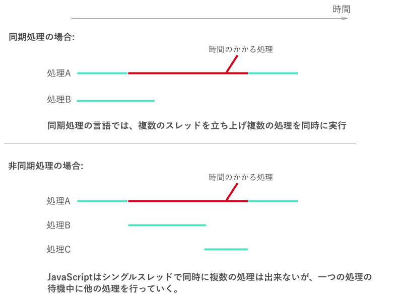

## 非同期処理とは

多くのプログラミング言語では、プログラムは上から下に順番に実行されていきます。しかし、例えばデータベースにアクセスしてデータを取得する場合など、処理に時間がかかるプログラムがその間に含まれる場合もあります。同期処理のプログラミング言語では、複数の処理を同時に行うマルチスレッドのモデルを取っています。JavaScriptシングルスレッドのモデルを取っており、同時に複数の処理を行うことが出来ません。

代わりにJavascriptでは、時間のかかる処理が完了するまでの間、他の処理を進めていき、その処理が終わった時に、またその処理の続きを再開する、ということが出来ます。これを非同期処理といいます。

また複数のイベント処理が山のように積み上がって(スタックといいます)おり、JavaScriptはこのスタック内をループしながら、時間のかかる処理が終わったかどうかをチェックしています。このループのことをイベントループと呼びます。

Javascriptで非同期処理を行うための仕組みはES5ではコールバック関数が使われており、ES6でPromise、ES7でAsync/Awaitという仕組みが導入されました。その3つそれぞれ使う機会が多いので、このレッスンではそれぞれを順番に解説していきます。